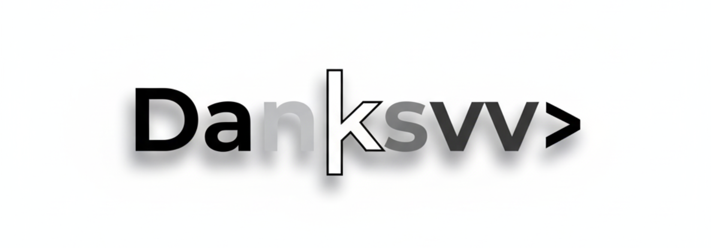

# 🚀 Mi Entorno de Desarrollo (Dotfiles)

¡Bienvenido a mi configuración personal! Este repositorio contiene todos los "dotfiles" (archivos de configuración) de mi entorno de desarrollo.

El objetivo es tener un entorno **limpio, eficiente y 100% reproducible** en cualquier máquina macOS. Todo está gestionado mediante [GNU Stow](https://www.gnu.org/software/stow/), lo que me permite mantener los archivos organizados aquí y enlazarlos simbólicamente a sus ubicaciones correctas en el sistema.

---

## 🛠️ Tecnologías Incluidas

Estas son las configuraciones que encontrarás en este repositorio. Cada carpeta está diseñada para ser un "paquete" de `stow`.

### ⚡ Zsh (`.zshrc`)

Es el "cerebro" de la terminal. Esta configuración, basada en **Oh My Zsh**, está optimizada para ser rápida, funcional y segura.

**Características principales:**

- **Organización:** El fichero `.zshrc` está dividido en secciones lógicas (OMZ, Exports, Alias, Funciones, Inits, Prompt) para un mantenimiento sencillo.
- **Carga Segura de Secretos:** Las claves de API (como `GEMINI_API_KEY`) no se guardan en el repositorio. Se cargan de forma segura desde un fichero local `.zshrc_private`, que está ignorado por `git`.
- **Gestor de Temas `LS_COLORS`:**
  - Las configuraciones de color de `ls` están en un fichero independiente (`.ls_themes.zsh`).
  - Incluye una función personalizada `set_ls_theme` para cambiar de tema al instante (ej. `set_ls_theme dracula`).
  - La función tiene autocompletado con `TAB` para ver todos los temas disponibles.
- **Inicialización de Herramientas:** Configura e inicializa automáticamente:
  - `Starship` (para un prompt moderno y personalizado)
  - `zoxide` (navegación de directorios inteligente)
  - `atuin` (historial de shell mejorado con BBDD)
  - `fnm` (gestor de versiones de Node.js)
  - `sdkman` (gestor de SDKs de Java y más)
  - `direnv` (gestor de variables de entorno por directorio)
- **Plugins Clave:**
  - `git`
  - `zsh-autosuggestions`
  - `zsh-syntax-highlighting`
  - `fast-syntax-highlighting`
  - `zsh-autocomplete`

### ⚡ Neovim (`nvim`)

Mi editor de código principal. Es mi IDE completo para todo.

- **Función:** Un editor de texto modal, extensible y basado en terminal.
- **Configuración:** Mi setup está basado en **LazyVim**, lo que me proporciona una base sólida con carga perezosa de plugins. Incluye:
  - Soporte completo para LSP (autocompletado, diagnósticos).
  - Integración con Git (Gitsigns, Diffview).
  - Buscador "fuzzy" (Telescope).
  - Soporte para depuración (DAP).

### terminal Kitty (`kitty`)

Un emulador de terminal moderno y rápido, acelerado por GPU.

- **Función:** La ventana principal donde vivo y ejecuto todos mis comandos.
- **Configuración:** Mi `kitty.conf` define:
  - El tema de colores y la transparencia.
  - La fuente (probablemente una [Nerd Font](https://www.nerdfonts.com/) para los iconos).
  - Atajos de teclado para crear nuevas pestañas y ventanas (`splits`).

### terminal WezTerm (`wezterm`)

Otro excelente emulador de terminal acelerado por GPU, escrito en Rust.

- **Función:** Lo mantengo como alternativa a Kitty, principalmente porque su configuración se escribe en **Lua**, lo que me permite usar el mismo lenguaje que Neovim.
- **Configuración:** Similar a Kitty, define fuentes, colores y atajos.

### 🗂️ Zellij (`zellij`)

Un multiplexor de terminal moderno y muy fácil de usar (una alternativa a `tmux`).

- **Función:** Me permite tener múltiples sesiones, pestañas y paneles _dentro de una sola pestaña de la terminal_. Es esencial para mi flujo de trabajo:
  - **Panel 1:** Ejecutando Neovim.
  - **Panel 2:** Ejecutando un servidor de desarrollo.
  - **Panel 3:** Abierto para comandos de Git (`git st`, `git ac`, etc.).
- **Configuración:** Define mis atajos de teclado para moverme entre paneles, crear nuevos y renombrar pestañas.

---

## 🚀 Instalación Rápida (Guía para mi "Yo del Futuro")

Pasos para configurar una nueva máquina macOS desde cero.

### 1. Prerrequisitos (Instalar con Homebrew)

```bash
# Instalar las herramientas principales
brew install neovim kitty wezterm zellij

# Instalar el gestor de enlaces
brew install stow
```
